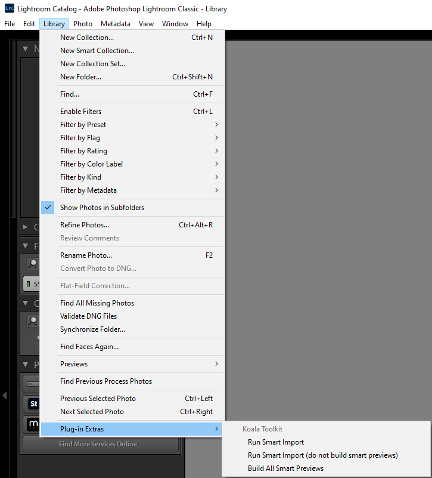

# Koala Toolkit for Lightroom Classic

Lightroom Classic utilities to manage better (not only) koala photos.



## Installation

1. Download the ZIP
2. Unzip
3. Open Lightroom Classic -> File -> Plug-in Manager
4. Click "Add" and select the unpacked folder `koala-toolkit.lrplugin`

## Smart Import

The Smart Import functionality is designed to help you import photos into Lightroom without importing duplicates such as `*_display.jpg`.

You probably only want to use Smart Import if you have problems with Lightroom's standard import dialog. Smart import imports all images from all library folders. It excludes trivial duplicates such as JPEG sidecar files. However, if you do not build smart previews it is slower than Lightroom's standard import dialog.

Note that Smart Import does not remove photos from your catalog that were removed from disk. You need to use the Synchronize feature of Lightroom Classic for this.

So this is far from perfect, but fits very well in my workflow. Let me know if you have any suggestions.

## Build All Smart Previews

A shortcut menu option to build smart previews for all photos in your catalog.

## Technical Limitations

This plugin uses the Adobe Lightroom SDK, which has some limitations.

Plugins can only import photos into one by one, which is slow. The other option would be to trigger LRC to open the import dialog or re-run a previous import, but this would import `*_display.jpg` files (which are exported previews used by other applications such as Mylio).

However, when also building smart previews on my computer it took the same time as the standard import dialog (but note that Smart Import blocks your UI, so you cannot organise and edit while importing).

Plugins also cannot remove photos from the catalog.

## Development

Windows development environment with [Scoop](https://scoop.sh/):

```shell
scoop install lua luarocks mingw
```

To generate test photos, run:

```shell
cd utils
poetry run test_photo_generator.py
```

### Debugging

For debugging I used [WinDbg](https://learn.microsoft.com/en-us/windows-hardware/drivers/debugger/).

For testing the plugin in early stages I used `utils/test_photo_generator` to create some photos and import them in an empty catalog. For QA I used a personal library of ~50K assets.

### Testing

Install busted first:

```shell
luarocks install --local busted
```

Make sure that installed scripts are your `PATH` environment variable, e.g., add `C:\Users\[USER]\AppData\Roaming\luarocks\bin`.

Tu run tests call:

```shell
busted -v
```

### Release Procedure

1. Fix version, finalise change log
2. Build the plugin package:

   ```shell
   cd utils
   poetry run build.py
   ```

3. Create a release on GitHub, upload the plugin package file
4. Bump version
